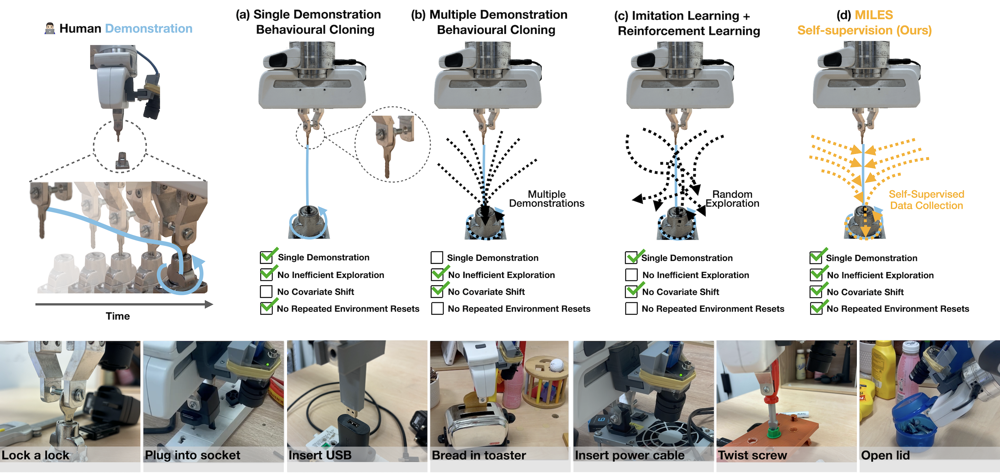

## 🤖 MILES: Making Imitation Learning Easy with Self-Supervision
This repository is template code for the paper: MILES: Making Imitation Learning Easy with Self-Supervision [[paper](https://arxiv.org/abs/2410.19693)]. 
Videos of MILES can be found our [[website](https://www.robot-learning.uk/miles)]. The complete implementation is dependent on your own hardware. In each file, you will find functions that will need to be implemented manually depending on your robot hardware.

### ✅ | Benefits of MILES
• Learns from a single demonstration\
• Requires one environment reset\
• Assumes no prior knowledge (e.g., object CAD models)\
For data collection videos please visit our [website](https://www.robot-learning.uk/miles).

### 🔩 | Robot Set Up
• For MILES we used an impedance controller run on a Franka Emika Panda. The same code can be used if you are using a position/velocity controller but we recommend impedance control for contact-rich tasks. \
• Wrist camera. The wrist camera should ideally be able to observe the object grasped in the robot's gripper in addition to the environment.\
• (Optional) Force Torque sensing. If you do not use a force sensor make sure to remove it as a modality from the policy learning.\

### 🦾 | Self-Supervised Data Collection
• The core idea of MILES is in the [data_collector.py](./data_collector.py) file. The data collector includes template code for the self-supervised data collection part of MILES. You will need to implement your own function to provide and replay demonstrations, as well as move your robot with your impedance controller. 

### 🧠 | Policy Learning

• Policy learning is straightforward. After the self-supervised data has been collected, run [policy_trainer.py](./policy_trainer.py). Policy training runs off the shelf.

### 🔭 | Policy Deployment 

• Policy deployment is also hardware dependent. The LSTM trained on MILES' augmentation tarjectories is deployed closed-loop until it converges to predicting the identity transformation, after which point the remaining demonstration segment (if a disturbance was detected during data collection) is replayed. More details are available in the file [deploy.py](./deploy.py)

### ⁉️ | Tips

• We recommend providing the demonstration starting near the object (see our [website](https://www.robot-learning.uk/miles) for examples) and subsampling the demontration so that in the end the demonstration comprises 50-100 demo waypoints for efficient data collection.\
• To approach an object from afar when placed at different poses we recommend first performing pose estimation followed by deploying MILES' policy. We recommend using the method described in [this paper](https://arxiv.org/abs/2105.06411) which we used for MILES or the method in [this paper](https://arxiv.org/abs/2310.12077).

